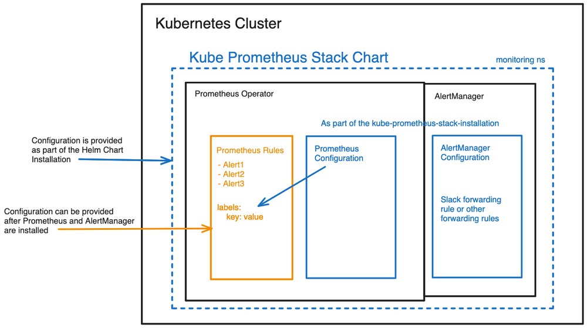
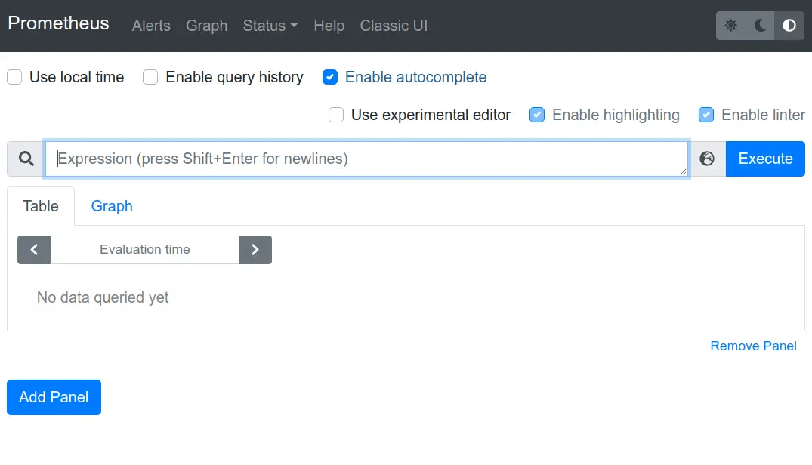
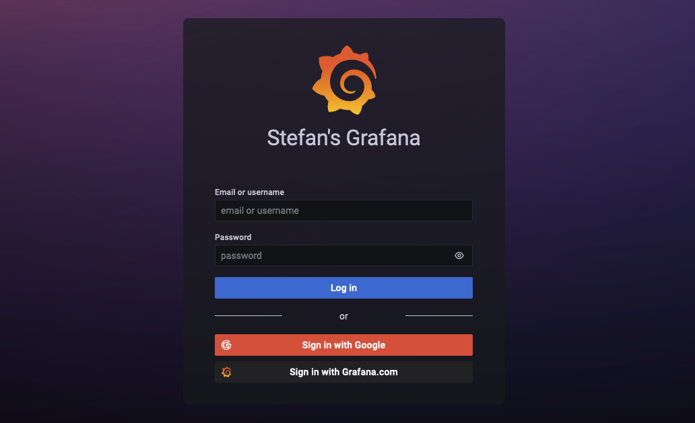

- [Real-World Prometheus Deployment: A Practical Guide for Kubernetes Monitoring](#real-world-prometheus-deployment-a-practical-guide-for-kubernetes-monitoring)
  - [Aim of the Project](#aim-of-the-project)
  - [Project Architecture](#project-architecture)
  - [Prerequisites](#prerequisites)
  - [Summary of What We Achieved](#summary-of-what-we-achieved)
  - [Understanding Kubernetes Resources](#understanding-kubernetes-resources)
    - [Deployment](#deployment)
      - [API Version and Kind](#api-version-and-kind)
      - [Metadata](#metadata)
      - [Specification (`spec`)](#specification-spec)
      - [Selector](#selector)
      - [Template](#template)
      - [Pod Specification (`spec` inside the template)](#pod-specification-spec-inside-the-template)
    - [Services](#services)
      - [API Version and Kind](#api-version-and-kind-1)
      - [Metadata](#metadata-1)
      - [Specification (`spec`)](#specification-spec-1)
    - [ServiceMonitor](#servicemonitor)
      - [API Version and Kind](#api-version-and-kind-2)
      - [Metadata](#metadata-2)
      - [Specification (`spec`)](#specification-spec-2)
    - [PrometheusRules](#prometheusrules)
      - [API Version and Kind](#api-version-and-kind-3)
      - [Metadata](#metadata-3)
      - [Specification (`spec`)](#specification-spec-3)
    - [AlertmanagerConfig](#alertmanagerconfig)
      - [API Version and Kind](#api-version-and-kind-4)
      - [Metadata](#metadata-4)
      - [Specification (`spec`)](#specification-spec-4)
  - [Author & Community](#author--community)

---

# **Real-World Prometheus Deployment: A Practical Guide for Kubernetes Monitoring**  

## **Aim of the Project**  

The primary goal of this **Prometheus Lab** project is to provide **hands-on experience** in setting up a **Prometheus monitoring system** on a **Kubernetes cluster**.  

By following this guide, you will:  
✅ Deploy **Prometheus** for real-time monitoring.  
✅ Understand **Kubernetes monitoring architecture**.  
✅ Set up **Grafana** for data visualization.  
✅ Configure **Alertmanager** for proactive notifications.  

---

## **Project Architecture**  

Below is a high-level architecture of the Prometheus monitoring setup:  

  

---

## **Prerequisites**  

Before we begin, ensure you have the following tools installed:  

- **`kubectl`** → To interact with the Kubernetes cluster.  
- **`Helm`** → For deploying Prometheus using Helm charts.  
- **`k3d`** → A lightweight Kubernetes distribution for local testing.  

---

## **📌 Step 1: Install `k3d` (Lightweight Kubernetes)**  

To create a **local Kubernetes cluster**, install `k3d` with:  

```bash
curl -s https://raw.githubusercontent.com/rancher/k3d/main/install.sh | bash
```

Verify the installation:  

```bash
k3d --version
```

---

## **📌 Step 2: Clone the GitHub Repository**  

All the necessary **YAML manifests** and configurations can be found in my GitHub repository:  

🔗 **GitHub Repo:**  

```text
https://github.com/panchanandevops/Learning-Prometheus.git
```

Clone the repository for easy access:  

```bash
git clone https://github.com/panchanandevops/Learning-Prometheus.git
cd Learning-Prometheus
```

---

## **📌 Step 3: Create a Namespace for Monitoring**  

All monitoring components should be deployed in a dedicated **namespace**.  

```bash
kubectl create namespace monitoring
```

Verify the namespace:  

```bash
kubectl get namespaces
```

---

## **📌 Step 4: Add the Prometheus Helm Repository**  

We will use Helm to deploy Prometheus and related components.  

```bash
helm repo add prometheus-community https://prometheus-community.github.io/helm-charts
helm repo update
```

This ensures we fetch the **latest** chart versions.

---

## **📌 Step 5: Store Default Helm Values**  

Before installing Prometheus, save the default configuration for customization.  

```bash
helm show values prometheus-community/kube-prometheus-stack > values.yaml
```

This file (`values.yaml`) contains settings for Prometheus, Grafana, and Alertmanager.

---

## **📌 Step 6: Install Prometheus Stack using Helm**  

Now, install the **kube-prometheus-stack** Helm chart in the `monitoring` namespace:  

```bash
helm install prometheus-stack prometheus-community/kube-prometheus-stack -n monitoring
```

🚀 **This deploys:**  

- **Prometheus** (for metrics collection)  
- **Grafana** (for visualization)  
- **Alertmanager** (for alert handling)  

---

## **📌 Step 7: Verify the Deployment**  

Check if the monitoring components are running:  

```bash
kubectl get pods -n monitoring
```

You should see multiple pods for **Prometheus, Grafana, and Alertmanager** in a `Running` state.

---

## **📌 Step 8: Access the Prometheus Dashboard**  

Prometheus exposes metrics and allows querying via its web UI.  

To access it locally, run:  

```bash
kubectl port-forward svc/prometheus-stack-prometheus -n monitoring 9090:9090
```

Now, open **[http://localhost:9090](http://localhost:9090)** in your browser.  

  

---

## **📌 Step 9: Access the Grafana Dashboard**  

Grafana provides a beautiful UI to visualize the metrics collected by Prometheus.  

To access it locally, run:  

```bash
kubectl port-forward svc/prometheus-stack-grafana -n monitoring 8080:80
```

Now, open **[http://localhost:8080](http://localhost:8080)** in your browser.  

  

---

## **📌 Step 10: Login to Grafana**  

Grafana uses **default credentials**:  

- **Username:** `admin`  
- **Password:** Retrieve the password using:  

  ```bash
  kubectl get secret prometheus-stack-grafana -n monitoring -o jsonpath='{.data.admin-password}' | base64 --decode ; echo
  ```

- Copy the password and **log in** to Grafana.  

---

## **📌 Step 11: Configure `values.yaml` for AlertmanagerConfig**  

By default, Prometheus does not automatically pick up **AlertmanagerConfig** CRDs.  

To enable it, **edit `values.yaml`** and search for `alertmanagerConfigSelector`.  

Replace that section with:  

```yaml
alertmanagerConfigSelector:
  matchLabels:
    release: prometheus
```

This ensures **custom alerting rules** are applied.

---

## **📌 Step 12: Apply Kubernetes YAML Manifests**  

Once the setup is complete, apply all the necessary Kubernetes resources:  

```bash
kubectl apply -f <your-path>/k8s-yaml/
```

This will configure:  
✅ **ServiceMonitor** (for scraping custom metrics).  
✅ **PrometheusRules** (for setting up alert conditions).  
✅ **AlertmanagerConfig** (for sending notifications).  

---

## **Summary of What We Achieved**  

| **Step** | **Action** |
|----------|------------|
| 🛠 **Setup** | Installed `k3d`, `kubectl`, `Helm` |
| 📥 **Downloaded** | Cloned GitHub repo |
| 📦 **Created Namespace** | `monitoring` |
| 🔹 **Added Helm Repo** | `prometheus-community` |
| 📜 **Saved Config** | Stored `values.yaml` |
| 🚀 **Deployed Stack** | Installed `kube-prometheus-stack` |
| 📊 **Accessed Dashboards** | Prometheus & Grafana |
| ⚙ **Configured Alerts** | Modified `values.yaml` |
| 📌 **Applied Manifests** | `kubectl apply -f k8s-yaml/` |

🚀 **Now you have a fully functional Prometheus monitoring setup on Kubernetes!**

---

# **Understanding Kubernetes Resources**

## **Deployment**  

A **Deployment** in Kubernetes is used to ensure that a set of identical **pods** (containers running your application) are always running. It allows you to easily scale your application, update it without downtime, and recover from failures.  

Now, let’s break down the **Deployment YAML file** step by step.  

---

### **API Version and Kind**

```yaml
apiVersion: apps/v1
kind: Deployment
```

- `apiVersion: apps/v1` → This specifies the **API version** of Kubernetes being used.  
- `kind: Deployment` → This tells Kubernetes that we are creating a **Deployment** resource.  

A **Deployment** helps in managing a set of pods by ensuring they stay available and can be updated smoothly.  

---

### **Metadata**

```yaml
metadata:
  name: my-deployment
  labels:
    app: api
```

- `name: my-deployment` → The name of the Deployment. It must be unique within the namespace.  
- `labels:`  
  - `app: api` → A label assigned to this Deployment. Labels help **group, filter, and identify** Kubernetes resources.  

📌 **Why labels?**  
Labels allow you to easily select and manage Kubernetes objects. For example, we can list all pods that belong to this Deployment using:  

```bash
kubectl get pods -l app=api
```

---

### **Specification (`spec`)**

This section defines **how** the Deployment should behave.  

---

#### **Selector**  

The **selector** tells Kubernetes **which pods** this Deployment should manage.  

```yaml
selector:
  matchLabels:
    app: api
```

- This means the Deployment will look for pods with the label **`app: api`**.  
- Only these labeled pods will be controlled by this Deployment.  

📌 **Why is this needed?**  
Because a Kubernetes cluster may have **many** Deployments and pods, the **selector** ensures that only the right pods are managed by this Deployment.  

---

#### **Template**  

The **template** defines how new pods should be created when the Deployment starts or scales up.  

```yaml
template:
  metadata:
    labels:
      app: api
  spec:
```

- `metadata:`  
  - `labels: app: api` → The pod will have the same label as the Deployment.  
- `spec:` → This is where we define what should **run inside the pod** (the containers).  

📌 **Why is this needed?**  
When Kubernetes creates new pods using this Deployment, it **ensures** that every pod gets the same labels and configurations.

---

#### **Pod Specification (`spec` inside the template)**  

Now, let’s define the actual **container** that runs inside the pod.  

```yaml
    containers:
      - name: my-container
        image: panchanandevops/myexpress:v0.1.0
        resources:
          limits:
            memory: "128Mi"
            cpu: "500m"
        ports:
          - containerPort: 3000
```

- **`containers:`** → A pod can run **one or more** containers. In this case, we have one container named **`my-container`**.  
- **`image: panchanandevops/myexpress:v0.1.0`** → This is the **Docker image** that will be pulled from Docker Hub or a private registry.  
- **Resource Limits (`resources:`)**  
  - `memory: "128Mi"` → The container can use a maximum of **128 MiB of RAM**.  
  - `cpu: "500m"` → The container can use up to **0.5 CPU cores** (500 milliCPU).  
- **Port (`ports:`)**  
  - `containerPort: 3000` → This means the container **listens** for requests on port `3000`.  

📌 **Why are resource limits important?**  
Setting **resource limits** prevents a single container from consuming all system resources, ensuring **fair resource distribution** among all containers in the cluster.

---

### **Services**

A **Service** in Kubernetes is used to expose a set of pods as a **network service**. Even if pods are created and destroyed, the Service ensures that requests always reach the correct backend pods.  

Now, let’s break down the **Service YAML file** step by step.  

---

### **API Version and Kind**

```yaml
apiVersion: v1
kind: Service
```

- `apiVersion: v1` → Specifies the API version used for defining the Service.  
- `kind: Service` → Tells Kubernetes that we are creating a **Service** resource.  

📌 **Why do we need a Service?**  
Pods have **dynamic IP addresses**, which means their IPs can change when they restart. A **Service provides a stable IP and DNS name** to ensure that traffic always reaches the right pods, even if they get recreated.

---

### **Metadata**

```yaml
metadata:
  name: my-service
  labels:
    job: node-api
    app: api
```

- `name: my-service` → The unique name of the Service.  
- `labels:`  
  - `job: node-api` → This label is used to categorize the Service.  
  - `app: api` → This label helps in grouping and managing resources.  

📌 **Why use labels?**  
Labels help in organizing and selecting Kubernetes resources. For example, we can find all services related to `app: api` using:  

```bash
kubectl get services -l app=api
```

---

### **Specification (`spec`)**

The **spec** defines how the Service will behave.  

```yaml
spec:
  type: ClusterIP
  selector:
    app: api
  ports:
    - name: web
      protocol: TCP
      port: 3000
      targetPort: 3000
```

---

### **Breaking Down the Service Spec**  

#### **1️⃣ Service Type (`type`)**

```yaml
  type: ClusterIP
```

- **ClusterIP (default)** → Makes the Service accessible **only within the cluster**.  
- Other types of Services:  
  - **NodePort** → Exposes the Service on a port on each node.  
  - **LoadBalancer** → Provides an external IP via a cloud provider's load balancer.  
  - **ExternalName** → Maps the Service to an external DNS name.  

📌 **Why use ClusterIP?**  
If the Service is meant for **internal communication** (e.g., backend APIs talking to each other), ClusterIP is the best choice.

---

#### **2️⃣ Selector (`selector`)**

```yaml
  selector:
    app: api
```

- The **selector** ensures that this Service sends traffic to pods that have the label `app: api`.  
- Only these pods will receive requests from this Service.  

📌 **Why is this needed?**  
Because Kubernetes may have **many pods**, we need a way to **match** the correct ones for the Service to route traffic.

---

#### **3️⃣ Ports (`ports`)**

```yaml
  ports:
    - name: web
      protocol: TCP
      port: 3000
      targetPort: 3000
```

- `name: web` → A **name** for the port (useful for debugging and monitoring).  
- `protocol: TCP` → Specifies the network protocol used (default is TCP).  
- `port: 3000` → The port **exposed by the Service** (used by other services to connect).  
- `targetPort: 3000` → The **port inside the pod** where the application is running.  

📌 **Why is `targetPort` needed?**  
Sometimes, the Service port (`port: 3000`) and the pod's container port (`targetPort: 3000`) **can be different**. Kubernetes maps the incoming request from the Service port to the correct container port.

---

## **ServiceMonitor**

A **ServiceMonitor** is a **custom resource** used by Prometheus **to discover and scrape metrics from Kubernetes services**. Instead of manually configuring Prometheus to collect metrics from services, we define a **ServiceMonitor** that dynamically discovers the right endpoints.  

Now, let’s break down the **ServiceMonitor YAML file** step by step.  

---

### **API Version and Kind**

```yaml
apiVersion: monitoring.coreos.com/v1
kind: ServiceMonitor
```

- `apiVersion: monitoring.coreos.com/v1` → This API is specific to **Prometheus Operator**, which manages monitoring in Kubernetes.  
- `kind: ServiceMonitor` → Defines this resource as a **ServiceMonitor**, which tells Prometheus where to collect metrics from.

📌 **Why do we need a ServiceMonitor?**  
Prometheus does not automatically know which services to monitor. A **ServiceMonitor automatically finds and scrapes metrics from matching services** in Kubernetes.

---

### **Metadata**

```yaml
metadata:
  name: api-service-monitor
  labels:
    release: prometheus
    app: prometheus
```

- `name: api-service-monitor` → The name of the ServiceMonitor.  
- `labels:`  
  - `release: prometheus` → Associates this monitor with a specific Prometheus instance.  
  - `app: prometheus` → Indicates that this ServiceMonitor is part of the Prometheus monitoring setup.

📌 **Why use labels here?**  

- Prometheus Operator uses labels to **discover ServiceMonitors** that it should scrape.  
- If the Prometheus instance is deployed with `release: prometheus`, it will only pick up ServiceMonitors with the **same label**.  

---

### **Specification  (`spec`)**  

The **spec** defines how Prometheus should scrape metrics from services.  

```yaml
spec:
  jobLabel: job
  selector:
    matchLabels:
      app: api
  endpoints:
    - port: web
      path: /swagger-stats/metrics
```

---

### **Breaking Down the ServiceMonitor Spec**  

#### **1️⃣ Job Label (`jobLabel`)**

```yaml
  jobLabel: job
```

- Specifies that the **job name** for Prometheus should be taken from the `job` label in the Service.

📌 **Why is this needed?**  
In Prometheus, each **scraped target** (like a service) is associated with a **job name**. This helps in **grouping metrics** for easier analysis.

---

#### **2️⃣ Selector  (`selector`)**

```yaml
  selector:
    matchLabels:
      app: api
```

- The **selector** ensures that the ServiceMonitor only scrapes **services** that have the label `app: api`.  
- It **filters** which services should be monitored.  

📌 **How does this work?**  
If we have a **Kubernetes Service** defined like this:  

```yaml
metadata:
  labels:
    app: api
```

Then, the ServiceMonitor will find this service and scrape its metrics.

---

#### **3️⃣ Endpoints (`endpoints`)**

```yaml
  endpoints:
    - port: web
      path: /swagger-stats/metrics
```

- `port: web` → Specifies **which port** of the service should be used for scraping metrics.  
- `path: /swagger-stats/metrics` → Specifies the **URL path** where Prometheus can fetch metrics.  

📌 **Why do we need `endpoints`?**  
A service may have multiple ports, but only **one of them exposes Prometheus metrics**. This section tells Prometheus **exactly where to look**.

---

## **PrometheusRules**  

A **PrometheusRule** is a **custom resource** that defines **alerting and recording rules** for Prometheus. It helps in setting up automated **alerts** based on specific conditions in your metrics.  

Now, let’s break down the **PrometheusRules YAML file** step by step.  

---

### **API Version and Kind**  

```yaml
apiVersion: monitoring.coreos.com/v1
kind: PrometheusRule
```

- `apiVersion: monitoring.coreos.com/v1` → This API is part of the **Prometheus Operator**, which manages monitoring rules in Kubernetes.  
- `kind: PrometheusRule` → Defines this resource as a **PrometheusRule**, which contains alerting and recording rules.  

📌 **Why do we need PrometheusRules?**  

- To **automatically trigger alerts** when specific conditions are met.  
- To **define recording rules** that precompute expensive queries for better performance.  

---

### **Metadata**

```yaml
metadata:
  name: api-prometheus-rule
  labels:
    release: prometheus
```

- `name: api-prometheus-rule` → The name of this rule set.  
- `labels:`  
  - `release: prometheus` → Associates this rule with the Prometheus instance.  

📌 **Why use labels here?**  
Prometheus Operator looks for **PrometheusRule** objects that match a Prometheus instance using **labels**. If your Prometheus setup is using `release: prometheus`, it will only load rules with the **same label**.

---

### **Specification (`spec`):**

The `spec` section defines **alerting rules** that tell Prometheus when to trigger alerts.  

```yaml
spec:
  groups:
    - name: api
      rules:
        - alert: down
          expr: up == 0
          for: 0m
          labels:
            severity: Critical
          annotations:
            summary: Prometheus target missing {{$labels.instance}}
```

---

### **Breaking Down the PrometheusRules Spec**  

#### **1️⃣ Groups (`groups`)**  

```yaml
  groups:
    - name: api
```

- A **group** is a collection of rules.  
- `name: api` → The **name of the rule group**, which helps in organizing alerts.  

📌 **Why use rule groups?**  

- **Groups allow efficient rule evaluation** by executing all rules in the same group at once.  
- Helps in **categorizing** rules based on different services (e.g., `api`, `database`, `network`).  

---

#### **2️⃣ Rules (`rules`)**  

Each group contains **one or more rules** that define alerting conditions.  

```yaml
rules:
  - alert: down
    expr: up == 0
    for: 0m
    labels:
      severity: Critical
    annotations:
      summary: Prometheus target missing {{$labels.instance}}
```

##### **🔹 Alert Name**

```yaml
  - alert: down
```

- `alert: down` → This is the **name of the alert** that will be triggered when the condition is met.

---

##### **🔹 Alert Expression (`expr`)**

```yaml
    expr: up == 0
```

- The **expression** determines when the alert should trigger.  
- `up == 0` → The **`up`** metric in Prometheus indicates whether a target is reachable.  
  - `1` → The target is **healthy**.  
  - `0` → The target is **down**.  
- This rule **triggers an alert if the target is down**.

📌 **How does this work?**  
If an application crashes or a service becomes unreachable, the **`up` metric becomes 0**, and this alert fires. 🚨  

---

##### **🔹 Alert Duration (`for`)**

```yaml
    for: 0m
```

- Specifies how long the condition must hold **before triggering the alert**.  
- `0m` → The alert fires **immediately** when the condition is met.  
- You can set a delay (e.g., `5m`) to prevent **flapping alerts** (temporary issues that resolve quickly).  

📌 **Example:**  

- `for: 5m` → Only triggers if `up == 0` for **5 continuous minutes**.  
- `for: 0m` → Triggers **instantly** when `up == 0`.

---

##### **🔹 Labels (`labels`)**

```yaml
    labels:
      severity: Critical
```

- Labels **add metadata** to alerts.  
- `severity: Critical` → Marks this alert as **Critical**, helping categorize alerts by urgency.  

📌 **Why use labels?**  

- Allows **grouping and filtering alerts** in monitoring dashboards like Grafana.  
- Helps **alert managers** route notifications (e.g., send `Critical` alerts via SMS and `Warning` alerts via email).  

---

##### **🔹 Annotations (`annotations`)**

```yaml
    annotations:
      summary: Prometheus target missing {{$labels.instance}}
```

- **Annotations provide extra information** about the alert.  
- `summary: Prometheus target missing {{$labels.instance}}`  
  - `{{$labels.instance}}` → Inserts the instance name (e.g., `my-service:9090`).  
  - The final alert message might look like:  
    - **"Prometheus target missing my-service:9090"**  

📌 **Why use annotations?**  

- Helps **provide context** in alerting tools like **Alertmanager, Slack, or PagerDuty**.  
- Reduces the need for manual investigation when an alert fires.

---

## **AlertmanagerConfig**  

An **AlertmanagerConfig** is a **custom resource** that helps define how **Alertmanager** handles alerts sent by **Prometheus**. It **routes alerts** to different receivers (e.g., email, Slack, PagerDuty) based on their **severity, labels, or conditions**.  

Now, let’s break down the **AlertmanagerConfig YAML file** step by step.  

---

### **API Version and Kind**  

```yaml
apiVersion: monitoring.coreos.com/v1
kind: AlertmanagerConfig
```

- `apiVersion: monitoring.coreos.com/v1` → Uses the **Prometheus Operator API** for managing alerting configurations.  
- `kind: AlertmanagerConfig` → Defines this resource as an **AlertmanagerConfig**, which specifies routing rules for alerts.  

📌 **Why do we need AlertmanagerConfig?**  

- It allows **custom alert routing** to different teams based on alert **severity** or **labels**.  
- Helps **avoid alert fatigue** by grouping and delaying alerts instead of spamming notifications.  

---

### **Metadata**  

```yaml
metadata:
  name: alertmanager-config
  labels:
    release: prometheus
```

- `name: alertmanager-config` → The name of this Alertmanager configuration.  
- `labels:`  
  - `release: prometheus` → Associates this configuration with a **Prometheus** instance.  

📌 **Why use labels here?**  
Labels ensure that **only the correct Prometheus instance** picks up this configuration.

---

### **Specification (`spec`)**:

The `spec` section defines **how alerts are grouped, delayed, and routed** to different receivers (e.g., email, Slack, webhook).  

---

### **1️⃣ Route Configuration**

```yaml
spec:
  route:
    groupBy: ["severity"]
    groupWait: 30s
    groupInterval: 5m
    repeatInterval: 12h
    receiver: "team-notifications"
```

This section **controls how alerts are grouped and routed** to receivers.  

#### **🔹 `groupBy`**

```yaml
    groupBy: ["severity"]
```

- Groups alerts based on their **severity** (e.g., Critical, Warning).  
- Instead of sending separate alerts for each **Critical** issue, it **bundles them together** into one notification.  

📌 **Example:**  

- Instead of sending **5 separate Critical alerts**, it sends **1 grouped alert** with all details.  

---

#### **🔹 `groupWait`**

```yaml
    groupWait: 30s
```

- **Waits for 30 seconds** before sending the first alert.  
- Helps **reduce noise** by allowing similar alerts to be **grouped** before notifying.  

📌 **Why use `groupWait`?**  
If an application crashes and **multiple alerts** fire at once, it **waits 30 seconds** to group them instead of sending them separately.

---

#### **🔹 `groupInterval`**

```yaml
    groupInterval: 5m
```

- After sending the first alert, it waits **5 minutes** before sending another batch of alerts.  
- Ensures that alerts for **the same issue** are **not repeatedly sent** in a short period.  

📌 **Example:**  
If 10 alerts fire within 5 minutes, only **one alert is sent** every 5 minutes.

---

#### **🔹 `repeatInterval`**

```yaml
    repeatInterval: 12h
```

- If an alert **remains active**, it sends **a reminder every 12 hours**.  
- Prevents excessive notifications while ensuring unresolved issues are **not ignored**.  

📌 **Example:**  
If an API server is down for 2 days, **reminders are sent every 12 hours** until it's resolved.

---

#### **🔹 `receiver`**

```yaml
    receiver: "team-notifications"
```

- Defines which **receiver** will handle this alert group.  
- Here, alerts are sent to a receiver named **"team-notifications"** (configured below).  

📌 **Why use receivers?**  
It helps direct alerts to the right **team** or **notification method** (e.g., Slack for engineers, PagerDuty for on-call teams).

---

### **2️⃣ Receiver Configuration**

```yaml
  receivers:
    - name: "team-notifications"
      emailConfigs:
        - to: "team@example.com"
          sendResolved: true
```

This section **defines how alerts are delivered**.  

#### **🔹 Receiver Name**

```yaml
    - name: "team-notifications"
```

- This **matches the receiver name** in `route.receiver`, meaning alerts will be **sent here**.  

---

#### **🔹 Email Notification (`emailConfigs`)**

```yaml
      emailConfigs:
        - to: "team@example.com"
          sendResolved: true
```

- **`to: "team@example.com"`** → Sends alerts to this **email address**.  
- **`sendResolved: true`** → Sends **another email** when the issue is **fixed**.  

📌 **Why use `sendResolved: true`?**  

- Without it, users only get an alert when an issue occurs.  
- With it, users **also get a notification when the issue is resolved**.  

---

### **🔹 Other Notification Methods**

Instead of **emailConfigs**, you can also use **Slack, PagerDuty, or Webhooks**:

✅ **Slack Notification Example**

```yaml
      slackConfigs:
        - channel: "#alerts"
          apiURL: "https://hooks.slack.com/services/XXX/YYY/ZZZ"
          sendResolved: true
```

✅ **PagerDuty Notification Example**

```yaml
      pagerdutyConfigs:
        - serviceKey: "your-pagerduty-key"
          sendResolved: true
```

📌 **Why use multiple receivers?**  

- Send **Critical alerts to PagerDuty**.  
- Send **Warning alerts to Slack**.  
- Send **All alerts to email**.

---

### **Summary**

✅ This **AlertmanagerConfig** will:  

1. **Group alerts by severity** (`Critical`, `Warning`).  
2. **Delay the first alert by 30s** to prevent spam.  
3. **Send only one alert every 5 minutes** for ongoing issues.  
4. **Repeat unresolved alerts every 12 hours**.  
5. **Send alerts to `team@example.com` via email**.  
6. **Notify when an alert is resolved** (`sendResolved: true`).  

---

### **Real-World Example**

Imagine you are running a **Kubernetes cluster**, and your **API server crashes**.  

1. Prometheus detects the failure (`up == 0`).  
2. The **PrometheusRule** fires an alert.  
3. The **AlertmanagerConfig**:  
   - Waits 30s to group similar alerts.  
   - Sends an email to **<team@example.com>**.  
   - If the issue is not resolved, it **reminds the team every 12 hours**.  
4. When the API server **recovers**, an email **confirmation is sent**.  

---

## **Author & Community**  

This project is crafted by **[Harshhaa](https://github.com/NotHarshhaa)** 💡.  
I’d love to hear your feedback! Feel free to share your thoughts.

---

### **Connect with me:**

[](https://linkedin.com/in/harshhaa-vardhan-reddy) [](https://github.com/NotHarshhaa)  [](https://t.me/prodevopsguy) [](https://dev.to/notharshhaa) [](https://hashnode.com/@prodevopsguy)  

---

### 📢 **Stay Connected**  


